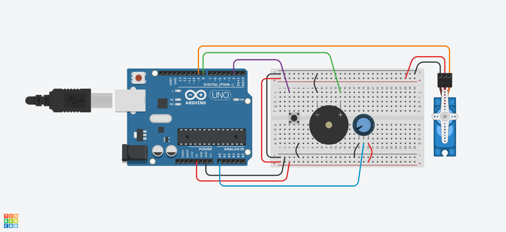

## 04. Звук и движение
Зуммер и сервопривод SG-90

**Тема:** Вывод звука с помощью зуммера и управление сервоприводом SG-90. Библиотека `Servo`, функция `tone()`.  
**Цель:** освоить два новых типа вывода — звук и механическое движение; научиться подключать зуммер и сервопривод, использовать библиотеку `Servo`, управлять углом поворота и частотой звука; закрепить работу с `#define`, вводом с потенциометра и кнопки.  
**Оборудование:** Arduino UNO, USB-кабель, макетная плата, провода, зуммер, сервопривод SG-90, потенциометр, кнопка, резистор 10 кОм.

---

## Ход урока

### 1. Повторение (5 мин)
- Что умеем: управлять светодиодами, читать кнопку, потенциометр, фоторезистор.
- Вспомнить: `#define`, `pinMode`, `digitalRead`, `analogRead`, `analogWrite`, `if ... else`, `INPUT_PULLUP`.
- Вопрос: а можно ли заставить Arduino **издавать звук** и **двигать** что-то механическое?

### 2. Новые типы вывода (5 мин)
- До сих пор выводами были светодиоды. Сегодня добавим:
  - **Зуммер** — выводит звук.
  - **Сервопривод** — выводит движение (поворот вала на заданный угол).
- Объяснение названий:
  - Зуммер — от нем. *summen* — «жужжать». Устройство, которое пищит.
  - Сервопривод — от лат. *servus* — «слуга» + «привод». Механизм, который «слушается» команды и поворачивается на нужный угол.
  - Англ. **servo** — сокращение от *servomechanism*.

### 3. Зуммер: активный и пассивный (10 мин)
- В наборах встречаются два вида зуммеров:
  - **Активный** — пищит сам, как только подано питание. Управляется через `digitalWrite(BUZZER, HIGH)`.
  - **Пассивный** — пищит только при подаче сигнала нужной частоты. Управляется через `tone()`.
- Если при подаче `HIGH` зуммер молчит — он пассивный. Если пищит — активный.
- **Пассивный зуммер и `tone()`**:
  ```cpp
  tone(BUZZER, 440);   // включить звук частотой 440 Гц (нота «ля»)
  delay(500);
  noTone(BUZZER);      // выключить звук
  ```
- Объяснение названий:
  - `tone` — от англ. *tone* — «тон, звук». Включает звук заданной частоты.
  - `noTone` — «нет тона». Выключает звук.
  - Частота измеряется в **герцах** (Гц). 1 Гц = одно колебание в секунду.
  - Человек слышит примерно от 20 Гц до 20 000 Гц.
- Ноты первой октавы (Гц): до — 262, ре — 294, ми — 330, фа — 349, соль — 392, ля — 440, си — 494.

### 4. Сервопривод SG-90 (10 мин)
- **SG-90** — маленький сервопривод, поворачивается на угол от **0° до 180°**.
- Три провода:
  - **Коричневый** (или чёрный) — GND.
  - **Красный** — питание 5V.
  - **Оранжевый** (или жёлтый) — сигнальный, к пину Arduino.
- Управляется через **библиотеку** `Servo`. Библиотека — от англ. *library* — «хранилище». Это готовый набор команд, который подключают к скетчу.
- Подключение библиотеки и создание объекта:
  ```cpp
  #include <Servo.h>   // подключаем библиотеку
  Servo myServo;       // создаём объект — «наш сервопривод»
  ```
- В `setup()`:
  ```cpp
  myServo.attach(SERVO_PIN);   // привязываем сервопривод к пину
  ```
- В `loop()`:
  ```cpp
  myServo.write(90);   // повернуть на 90°
  ```
- Объяснение названий:
  - `#include` — от англ. *include* — «включать». Подключает библиотеку.
  - `attach` — от англ. *attach* — «прикрепить, привязать». Сообщает, к какому пину подключён сервопривод.
  - `write` — «записать». Передаёт угол поворота.
- Важно: сервопривод потребляет большой ток. Если он дёргается или Arduino перезагружается — нужен отдельный источник питания (адаптер 9 В через батарейный отсек).

### 5. Правила подключения (5 мин)
1. Зуммер: «+» (длинная ножка или метка) → к пину, «−» → к GND.
2. Сервопривод: коричневый → GND, красный → 5V, оранжевый → пин.
3. Зуммер и сервопривод подключаем к **разным пинам**, чтобы работали одновременно.
4. Сервопривод не крутим руками — можно сломать редуктор.
5. Не подключаем сервопривод к пинам 0 и 1 — они используются для связи с компьютером.

### 6. Схема подключения (одновременная работа) (5 мин)
- Зуммер:
    - «+» → пин **8**
    - «-» → **GND**
- Сервопривод: 
    - сигнальный (желтый) → пин **9**
    - питание (красный) → **5V**
    - GND (черный) → **GND**
- Потенциометр: крайние → **5V** и **GND**, средний → **A0**
- Кнопка: одна ножка → пин **2**, другая → **GND**



### 7. Практика 1: пищалка (7 мин)
```cpp
#define BUZZER 8

void setup() {
  pinMode(BUZZER, OUTPUT);
}

void loop() {
  tone(BUZZER, 440);
  delay(500);
  noTone(BUZZER);
  delay(500);
}
```
**Задание:** изменить частоту: 262, 330, 494. Сравнить, как звучит.

### 8. Практика 2: сирена (8 мин)
```cpp
#define BUZZER 8

void setup() {
  pinMode(BUZZER, OUTPUT);
}

void loop() {
  tone(BUZZER, 400);
  delay(300);
  tone(BUZZER, 800);
  delay(300);
}
```
**Задание:** сделать «пожарную сирену», «звук капли», «звук робота» — меняя частоты и задержки.

### 9. Практика 3: мелодия (8 мин)
```cpp
#define BUZZER 8

void setup() {
  pinMode(BUZZER, OUTPUT);
}

void loop() {
  tone(BUZZER, 262); delay(300);  // до
  tone(BUZZER, 294); delay(300);  // ре
  tone(BUZZER, 330); delay(300);  // ми
  tone(BUZZER, 349); delay(300);  // фа
  tone(BUZZER, 392); delay(300);  // соль
  noTone(BUZZER);
  delay(1000);
}
```
**Задание:** сыграть «Чижик-пыжик» или другую простую мелодию.

### 10. Практика 4: сервопривод-стрелка (8 мин)
```cpp
#include <Servo.h>

#define SERVO_PIN 9
Servo myServo;

void setup() {
  myServo.attach(SERVO_PIN);
}

void loop() {
  myServo.write(0);
  delay(1000);
  myServo.write(90);
  delay(1000);
  myServo.write(180);
  delay(1000);
  myServo.write(90);
  delay(1000);
}
```
**Задание:** изменить углы и задержки. Сделать так, чтобы сервопривод двигался как маятник часов.

### 11. Практика 5: сервопривод от потенциометра (8 мин)
```cpp
#include <Servo.h>

#define SERVO_PIN 9
#define POT A0
Servo myServo;

void setup() {
  myServo.attach(SERVO_PIN);
}

void loop() {
  int value = analogRead(POT);   // 0..1023
  int angle = value / 6;         // 0..170
  myServo.write(angle);
  delay(15);
}
```
**Задание:** сделать так, чтобы при повороте ручки сервопривод плавно поворачивался. Подобрать делитель так, чтобы угол шёл от 0 до 180.

### 12. Практика 6: сигнализация (5 мин)
- Кнопка нажата → зуммер пищит + сервопривод поворачивается на 90°.
- Кнопка отпущена → тишина + сервопривод на 0°.

```cpp
#include <Servo.h>

#define BUZZER 8
#define SERVO_PIN 9
#define BTN 2

Servo myServo;

void setup() {
  pinMode(BUZZER, OUTPUT);
  pinMode(BTN, INPUT_PULLUP);
  myServo.attach(SERVO_PIN);
}

void loop() {
  int state = digitalRead(BTN);

  if (state == LOW) {
    tone(BUZZER, 800);
    myServo.write(90);
  } else {
    noTone(BUZZER);
    myServo.write(0);
  }
}
```

### 13. Вопросы для обсуждения (5 мин)
1. Чем отличается активный зуммер от пассивного?
2. Что делает `tone()`? Что измеряется в герцах?
3. Как выключить звук?
4. Что такое библиотека? Зачем нужна `Servo`?
5. Что делает `myServo.attach()` и `myServo.write()`?
6. Почему сервопривод может дёргаться при питании от Arduino?
7. Почему нельзя крутить сервопривод руками?
8. Как перевести значение с потенциометра (0…1023) в угол (0…180)?

### 14. Итог и рефлексия (5 мин)
- Что нового узнали о выводе звука и движении?
- Что было самым интересным?
- Какие правила подключения запомнили?
- Домашнее задание: придумать проект, где зуммер и сервопривод работают вместе (например, «робот-охранник», «музыкальная шкатулка»).

---

## Ключевые слова для запоминания
Зуммер, активный, пассивный, `tone`, `noTone`, частота, герц, сервопривод, servo, SG-90, угол, `#include`, библиотека, `Servo`, `attach`, `write`, `myServo`, `analogRead`, `digitalRead`, `INPUT_PULLUP`, `if`, `else`, `LED_R`-стиль именования: `BUZZER`, `SERVO_PIN`, `BTN`, `POT`.